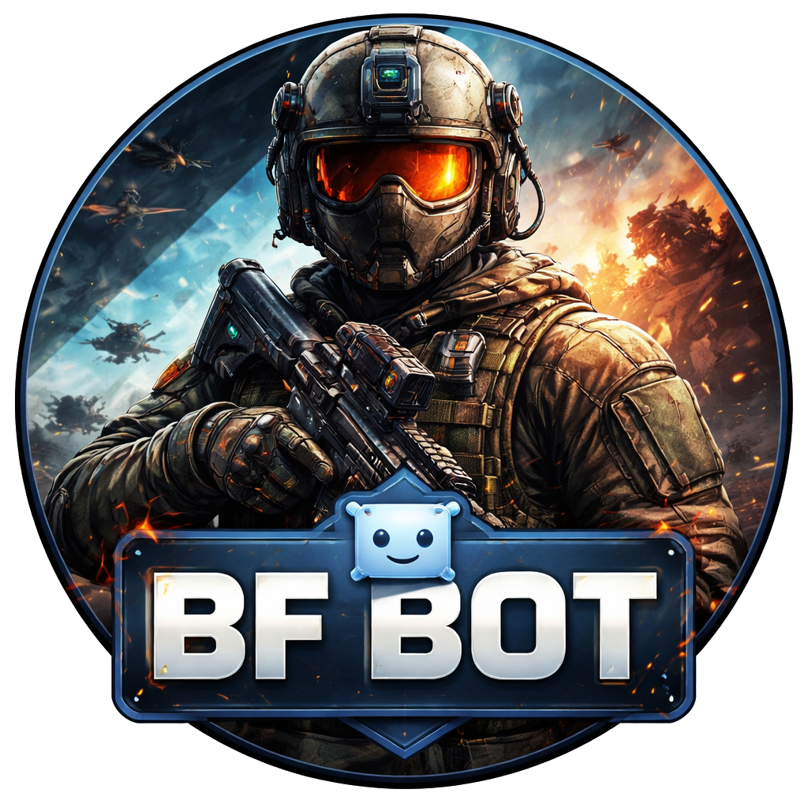

<p align="center">
    
</p>

# Battlefield 6 Tracker Discord Bot

A Discord bot that monitors player statistics in Battlefield 6 using the [GameTools API](https://api.gametools.network/bf6/stats/).  
It posts updates when a player's `timePlayed` changes and reports kills per session.

## Features

- Monitors a list of players (configurable)
- Posts a message in a Discord channel when a player has activity
- Tracks `kills` per session
- Notification resets after inactivity
- Persistent state across restarts (`state.json`)
- Logs activity to `bot.log`
- Admin commands to manage players
- Custom help command

## Commands

All commands use the `!bf` prefix to avoid conflicts:

| Command | Description |
|---------|-------------|
| `!bf help` | Show help message |
| `!bf players` | List monitored players |
| `!bf addplayer <username>` | Add a player to monitor *(Admin only)* |
| `!bf removeplayer <username>` | Remove a player from monitoring *(Admin only)* |
| `!bf checkplayer <username>` | Fetch and display API stats for a player |

## Docker Setup

- Start the bot: `docker-compose up -d`
- Restart / update: `docker-compose restart`
- Stop / start:
    ```
    docker-compose down
    docker-compose up -d
    ```

## Notes
- Make sure the bot has permissions to view channels and send messages in Discord
- Never share your bot token
- Keep config.json and state.json backed up for persistent data

## Add Bot in Server
Use this [URL](https://discord.com/oauth2/authorize?client_id=1457034602773352657&permissions=3072&integration_type=0&scope=bot) to add the bot in your server.
